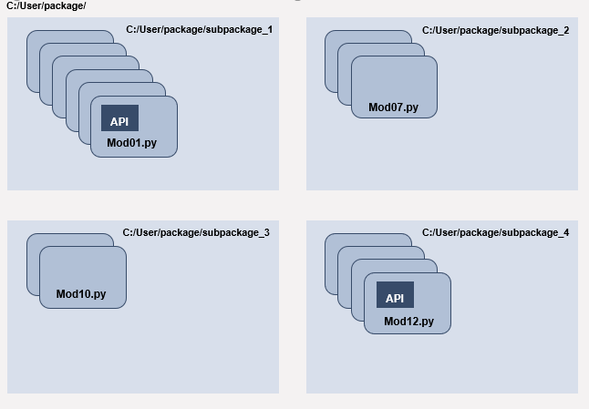

[buy me caffeine](https://ko-fi.com/V7V72SOHX)

# Basic python package

## Components

 * In the `pkgtemp`: a template of a basic python package with subpackages and modules
 * In `pkgtemp/sub_pkg1/modA.py` : examples of classes and inheritance
 * In `pkgtemp/sub_pkg2/modC.py` : examples of classes with special methods for comparing objects
 * In `pkgtemp/sub_pkg2/modD.py` : examples of classes with special methods for making instances of objects callable
 * In `pkgtemp/__version__.py` : all the details about the version, authors, etc.
 * In `pkgtemp/__init__.py` : empty by default, can be used to bound the subpackages and modules of a package at the upper level (easier import)
 * In `tests` : the unit tests
 * In `docs` : the package documentation (usually with sphinx)
 * In `requirements.txt` the dependencies being installed while installing `pkgtemp`

All the other files and folders are conveniences ones and are not part of the package. For more details, see the [hitchhicker guide](https://docs.python-guide.org/writing/structure/)

## Motivation

 * Modularity: to make code the most modular, you want lots of functions, classes, etc
 * Only execute function/methods/classes in notebooks, do not "store" or write definitions in a NB
 * Easy access to your code and cleaner NB/scripts
 * More automation
 * Reproducible ("hidden state" is opposed to reproducibility, the results might depend on the order you ran the cells, your defined functions might be fed by out-of-scope variables)
 * Easy to share/collaborate
 * You can set modules to automatically reload with %load_ext autoreload, %autoreload 1, and then %aimport module_name
 * Testing (unit, integration)
 * Versioning (NB are notoriously hard to version)

## What is a package

### Modules
A module is a *.py file containing Python code. Break down the code into modules for modularity. A python module is just one file containing code. Modular code is easier to work with. Less stuff to keep in (human) memory while coding, less scrolling, knowing exactly where to look when you have to find a particular thing, breaking big problems into smaller ones, etc.

### Package

A package is a folder containing either other folders (sub-packages) or modules (collections of *.py files), with specific files as well. It can be installed if certain requirements are met.

Suppose you have developed an application that includes several modules. As the number of modules grows, it becomes difficult to keep track of them all if they are dumped into one location. This is particularly so if they have similar names or functionality. You might wish for a means of grouping and organizing them. Packages allow for a hierarchical structuring of the module namespace using dot notation. In the same way that modules help avoid collisions between global variable names, packages help avoid collisions between module names.

Packages can contain nested subpackages to arbitrary depth. Each package in Python is a directory that MUST contain a special file called `__init__.py`. This file can be empty, and it indicates that the directory it contains is a Python package, so it can be imported the same way a module can be imported

### API
API: short for Application Programming Interface, refers to a collection of functions and classes which simplify programming by abstracting the underlying implementation and only exposing objects or actions the developer needs. An API is multi-purpose and not intended to produce a single output (not ad-hoc) but is a tool that can be reused for different projects and tasks.

E.G. lightGBM is written in C++ but offers several APIs: in python, R, etc.

## Making the package "installable"

For keeping it simple, the main file for doing this is the `setup.py`. The `setup.py` is a python file, the presence of which is an indication that the module/package you are about to install has likely been packaged and distributed with Distutils, which is the standard for distributing Python Modules. The setup script is the centre of all activity in building, distributing, and installing modules using the Distutils. The main purpose of the setup script is to describe your module distribution to the Distutils, so that the various commands that operate on your modules do the right thing.

This allows you to easily install Python packages:  

`pip install .`  or `pip install -e .` (editable mode, see below)

Do not forget the period `.` pip will use setup.py to install your module. Avoid calling setup.py directly. Although not required, it’s common to locally install your project in “editable” or “develop” mode while you’re working on it. This allows your project to be both installed and editable in project form. Although somewhat cryptic, `-e` is short for `--editable`, and `.` refers to the current working directory, so together, it means to install the current directory (i.e. your project) in editable mode.

## Installing the package
By installing the package, you will be able to import the different functions and classes in the package and sub-packages as: 
`from pkgtemp.sub_pkg1.modA import Convoy, Motorcycle, Vehicle`

You can use the setup.py to install the package

   - says the package is saved as `C:/Users/pkgtemp`
   - create a dedicated environment: `conda create -f pypkg-env.yml`
   - in a command prompt: `> conda activate pypkg-env`  
   - in the same command prompt: `> cd C:/Users/pkgtemp`
   - install using pip  `pip install .` or `pip install -e .` if you're still developing the code (pip will look for the `setup.py` and will proceed)

## Distruting a packages

For distributing a package, meaning making it available through a server like PyPi.org, a few other steps and files are required. 
However it is a danger zone since those servers are open and public. Only non-proprietary packages should be put there.